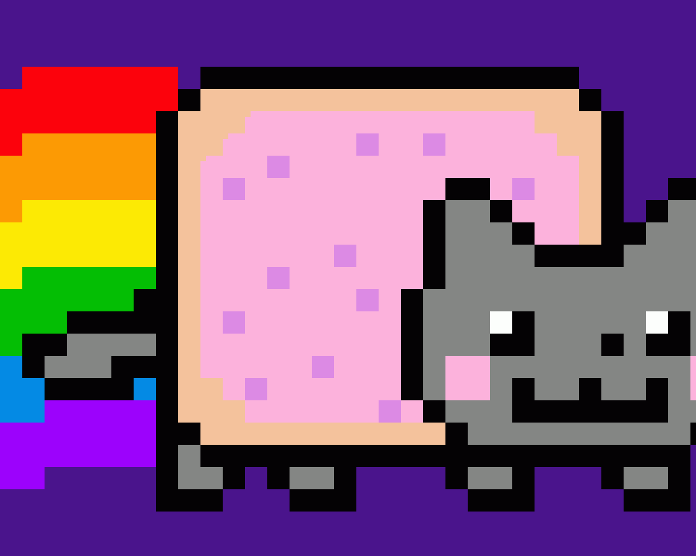

# Arthur Lu

A brief introduction.

**Contents:**
1. [Who am I?](#who-am-i)
2. [What do I do?](#what-do-i-do)
3. [What languages do I use?](#what-languages-do-i-use)
4. [What's a funny peice of code?](#whats-a-funny-peice-of-code)
5. [A blast from the past?](#a-blast-from-the-past)
6. [More about me](#more-about-me)

## Who am I?

- **3rd year Computer** Engineering student at UCSD
- Student Researcher at UCSD
- HPC enthuiast & Techie

## What do I do?

[WFA Accelerator research with Prof. Turakhia](https://turakhia.eng.ucsd.edu)

[Run Tronnet, an affordable HPC solution](https://tronnet.net)

## What languages do I use?

> C/C++

> python

> systemverilog

> ~~Java~~

## What is my TODO list?

- [x] finish this project
- [ ] approve all the PRs
- [ ] *learn how to exit VIM*

## What's a funny peice of code?

The fork bomb ***(run in bash at your own risk!)***:

```bash
:(){:|:&};:
```

## A blast from the past?

Rather than include an image of myself, here's nyan cat. I bet you havent though about this image in a long time:


## More about me

[Go to the this page for more about me](thispage.md)
